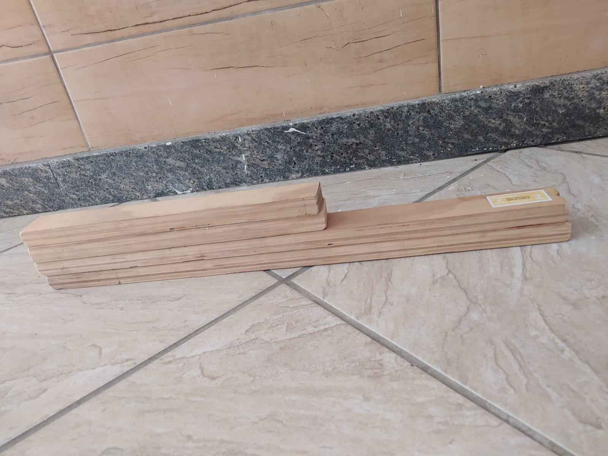
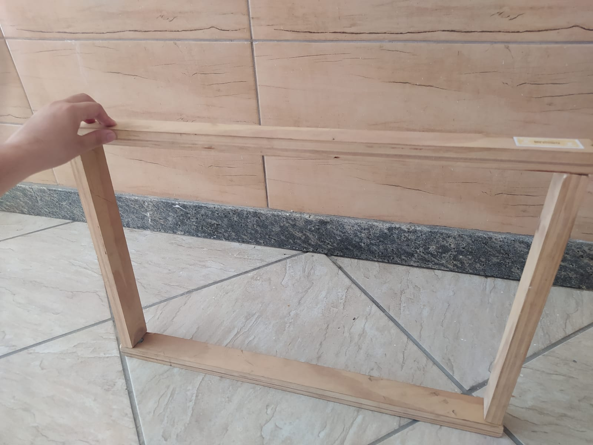
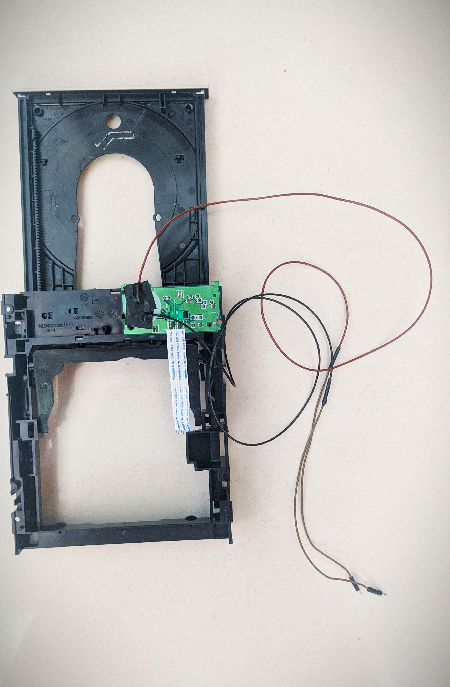
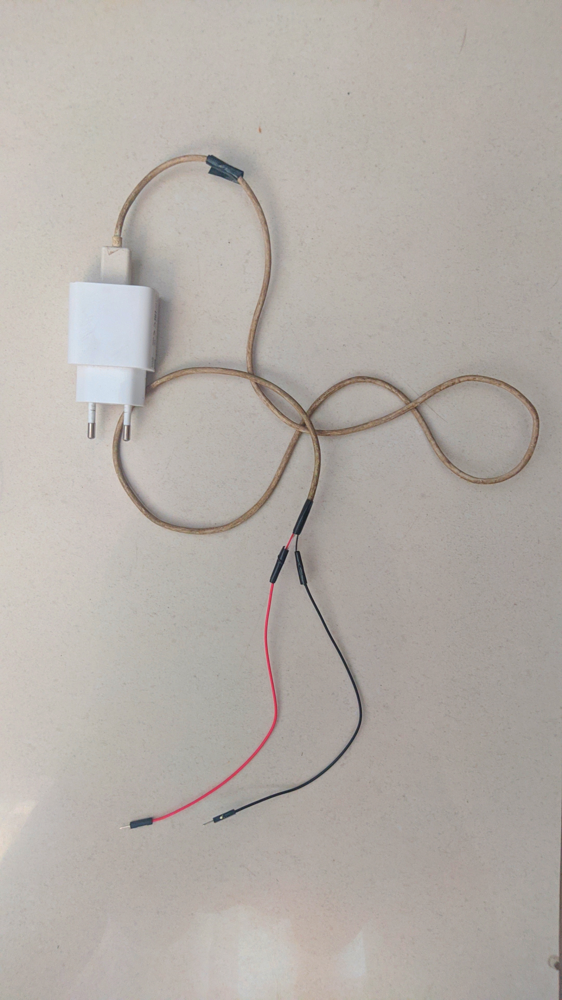
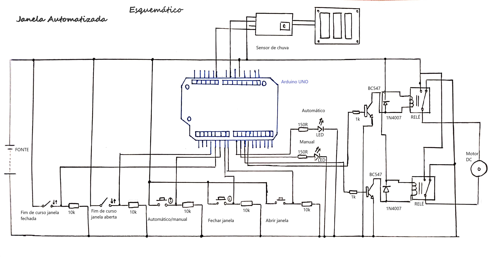
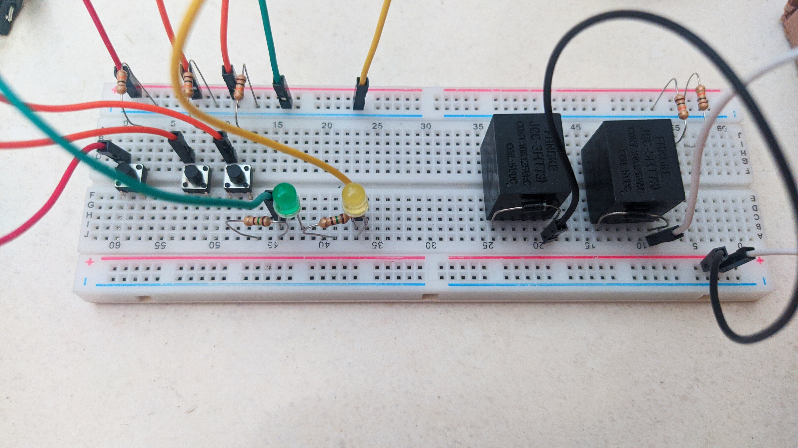
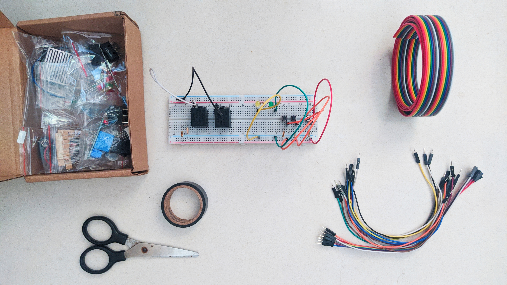
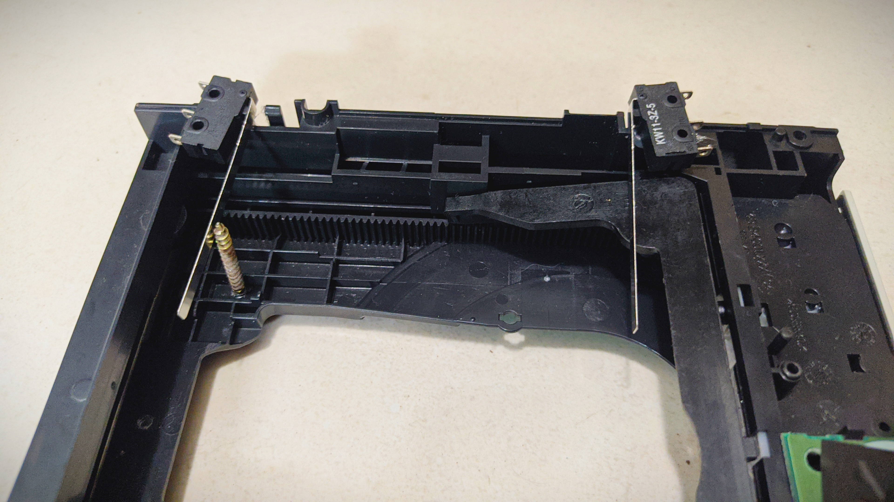
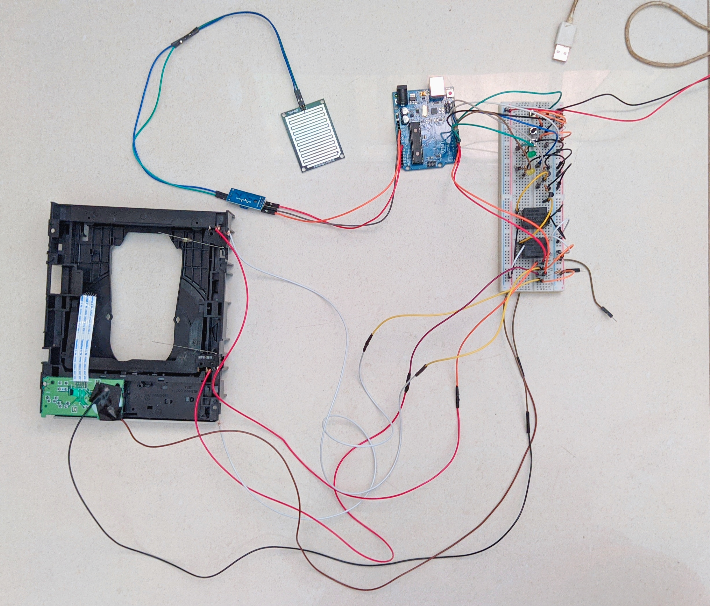

# O nosso processo de montagem

De início fizemos uma janela usando madeira:

Desmontamos a leitora de CD (clique na imagem abaixo para ver o video no youtube mostrando a leitora desmontada):

E conectamos fios na leitora para conectá-la ao circuito:

Para o circuito ter alimentação adaptamos um carregador de celular:

Então, montamos o projeto de acordo com o esquemático:

E o circuito montado na protoboard ficou:

Encaixamos os fins de curso e o parafuso na leitora de CD: 

Porém, no meio da montagem faltaram jumpers e o circuito ficou assim:

.jpg)

.jpg)

Aí, depois que conseguimos mais jumpers foi finalizada a montagem do circuito na protoboard:

Por enquanto o projeto está assim, é possível ver o nosso primeiro teste clicando na imagem abaixo:

##Para voltar pro readme clique [aqui](README.md)
