# O nosso processo de montagem

De início, ao invés de usar uma janela comum, fizemos uma janela usando madeira:

  

  

  

Desmontamos a leitora de CD (clique na imagem abaixo para ver o video no youtube mostrando a leitora desmontada):

Colocamos o fim de curso na leitora:

  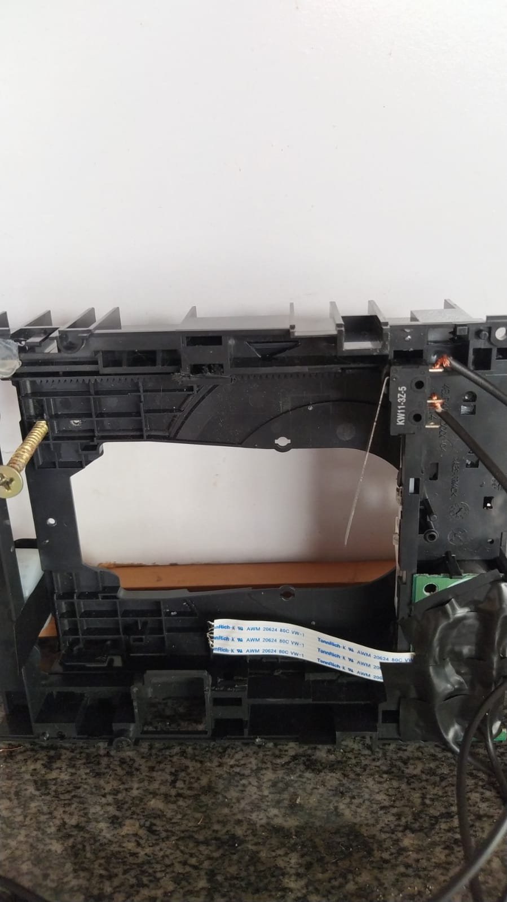

E conectamos fios na leitora para conectá-la ao circuito:

  

Para o circuito ter alimentação adaptamos um carregador de celular:

  

Então, montamos o projeto de acordo com o esquemático:

  

E o circuito montado na protoboard ficou:

  

  

Encaixamos os fins de curso e o parafuso na leitora de CD: 

  

Porém, no meio da montagem faltaram jumpers e o circuito ficou assim:

  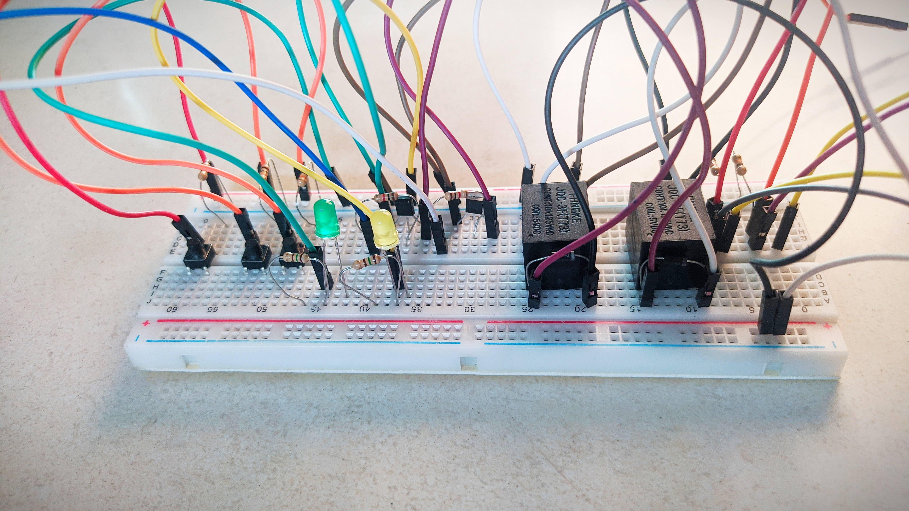

  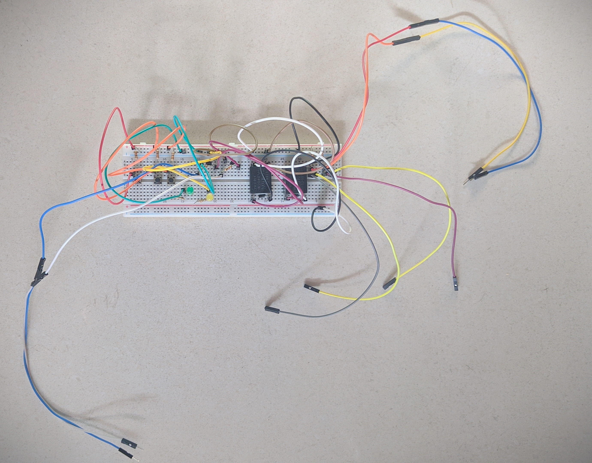

Aí, depois que conseguimos mais jumpers foi finalizada a montagem do circuito na protoboard:

  

Por enquanto o projeto está assim, é possível ver o nosso primeiro teste clicando na imagem abaixo:

Como é possível ver no vídeo, não conseguimos fazer tudo funcionar do jeito que deveria, então tivemos que fazer algo para tentar resolver o problema. Primeiramente checamos o funcionamento dos componentes e das partes do código para entender o que não estava funcionando.

  

Tentamos trocar os dois relés por uma alternativa mais simples usando apenas um relé do arduíno.

  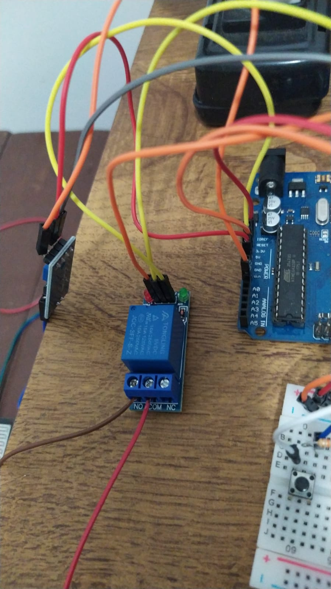

Porém, isso não deu certo então resolvemos mudar o projeto para, ao invés de fechar a janela automaticamente, o projeto avisar quando detectasse chuva com um buzzer, e para abrir e fechar a leitora de CD foi contruído um switch. Para isso, seguimos o esquemático:

  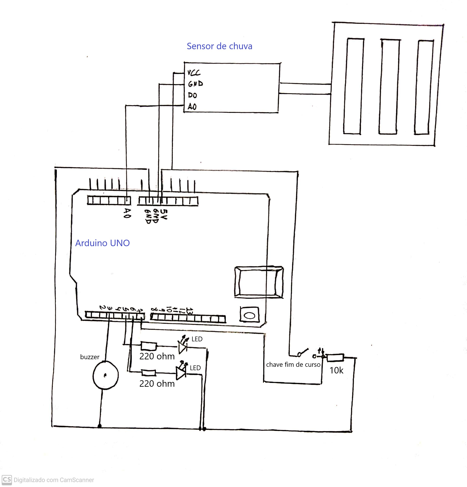

Então o circuito ficou assim:

  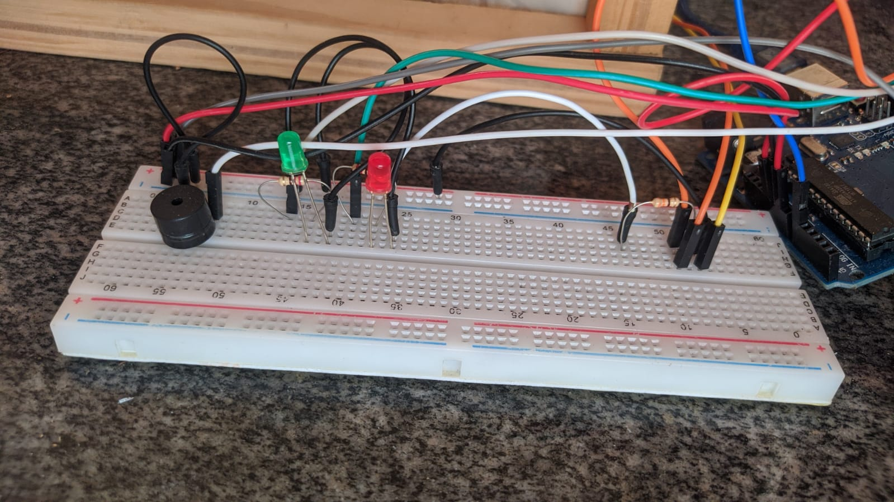

O switch construído foi esse:

  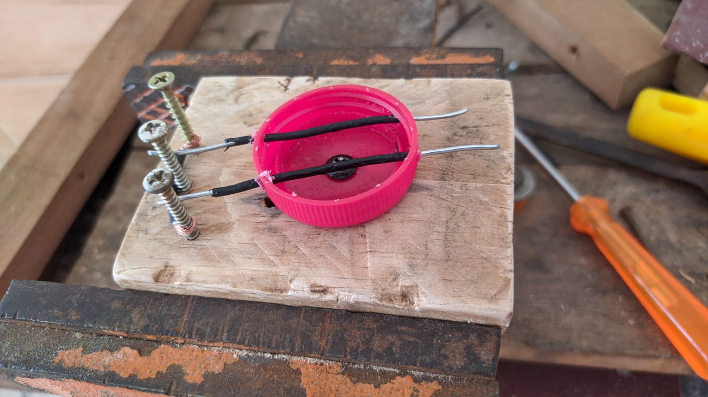

E para melhor funcionamento, fizemos outra janela.

  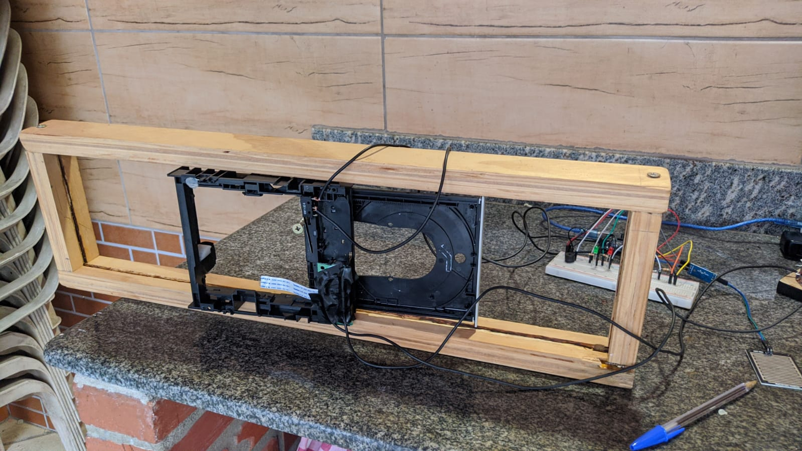

  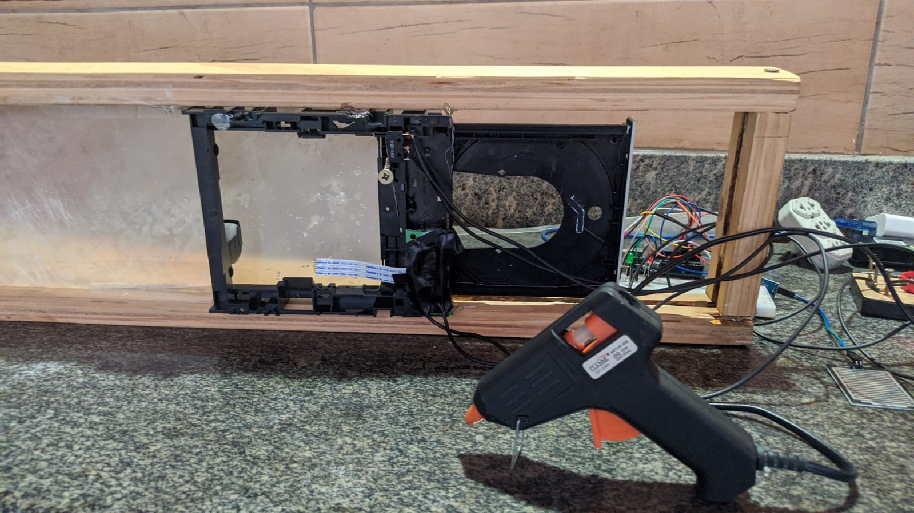

  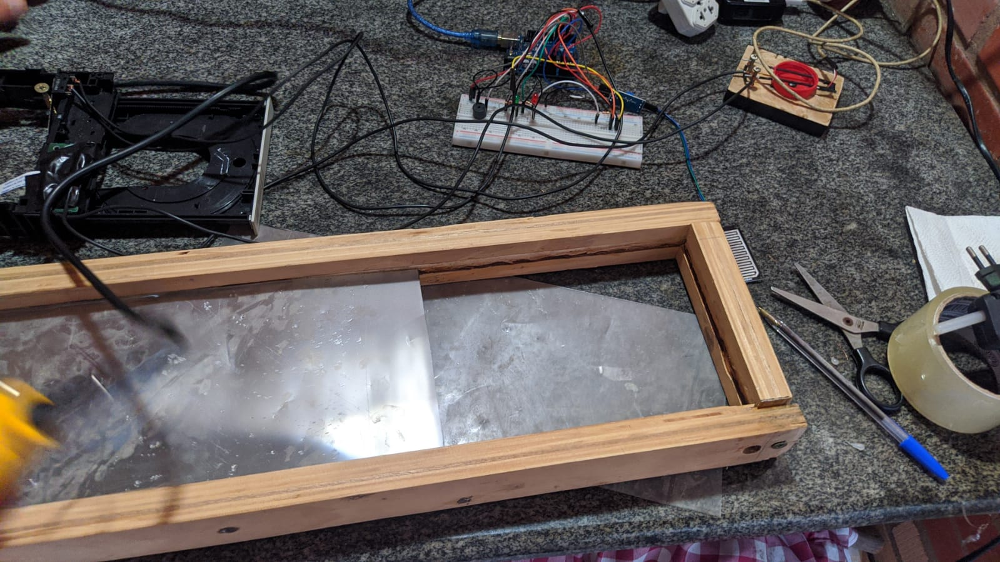

O projeto finalizado ficou assim:

  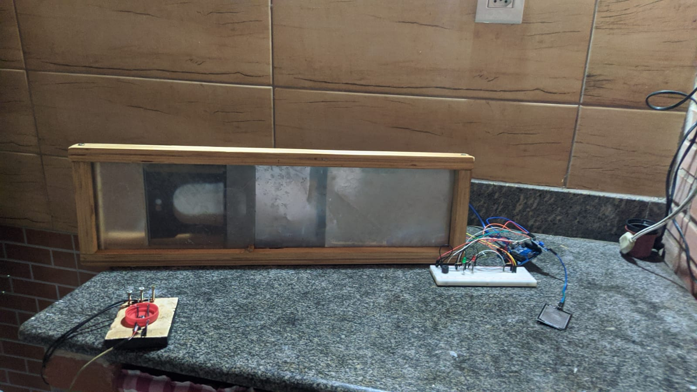

## Para voltar para o readme clique [aqui](README.md)
