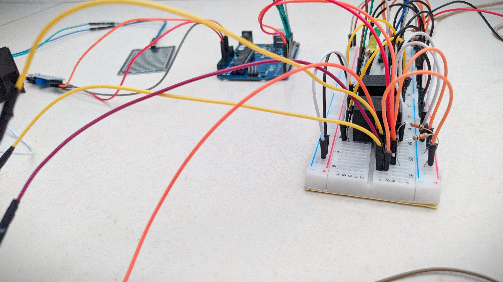
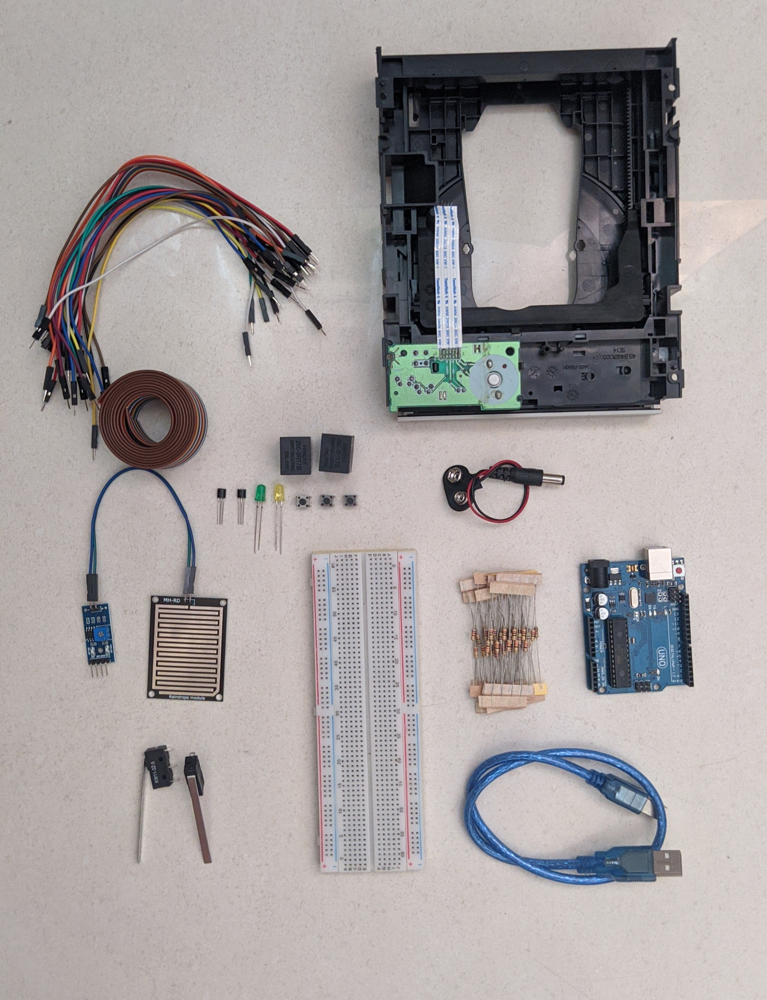

# PIC-Janela-Automatizada

Projeto da disciplina Projeto Integrado à Computação. Nessa disciplina faremos um sistema que fecha uma janela quando detecta chuva.

  

## Ideia do projeto

Projeto de uma janela residencial automatizada que fecha com a presença de chuva, além disso será possível abrir e/ou fechar com botões. A ideia é utilizar uma unidade de leitora de CD para abrir e fechar a janela quando o sensor detectar a presença de água ou quando um botão for acionado.

## Cronograma

- [x] - Todos os materiais em mãos que não sejam emprestados. (07/01)
- [x] - Primeira versão do código. (15/01)
- [x] - Início da montagem física do projeto. (30/01)
- [x] - Início do teste do projeto. (15/02)
- [x] - Melhorias físicas e no código. (28/02)

## Fases do projeto

- [x] Escolha de um projeto
- [x] Estudar Arduino
- [x] Pesquisa de materiais
- [x] Verificar preço de material
- [x] Compra de materiais
- [x] Inicio da montagem da janela
- [x] Verificar materiais que faltam com o professor
- [x] Desenvolvimento do código
- [x] Prototipação no tinkercad
- [x] Montagem do circuito

## Lista de componentes

  
  
  
  <ul>
    <li> 1  Arduino UNO; </il>
    <li> 1  Cabo do Arduíno; </il>
    <li> 2  Relés 5 Volts 5 Pinos; </il>
    <li> 1  Sensor de Chuva; </il>
    <li> 3  Botões NA; </il>
    <li> 2  Transistores BC548 ou BC337 ou BC547 NPN; </il>
    <li> 5  Resistores 10KΩ / 1/4W; </il>
    <li> 2  Resistores 1KΩ / 1/4W; </il>
    <li> 2  Diodos 1N4007 ou 1N4001; </il>
    <li> 2  LED´s; </il>
    <li> 1  Fonte de Alimentação 5V e uma compatível com o motor que for usado; </il>
    <li> 1  Protoboard; </il>
    <li> 1  Unidade leitora de CD ou 1 motor; </il>
    <li> 2  Metros de fio 0,5 mm; </il>
    <li> 1  Parafuso com porca; </il>
    <li> 2  Chaves fim de curso. </il>
  </ul>
 

 
 
 
 
 
 
 
 

## Para ver o nosso processo de montagem veja o nosso Do It Ourselves [(DIO)](DIO.md) 

