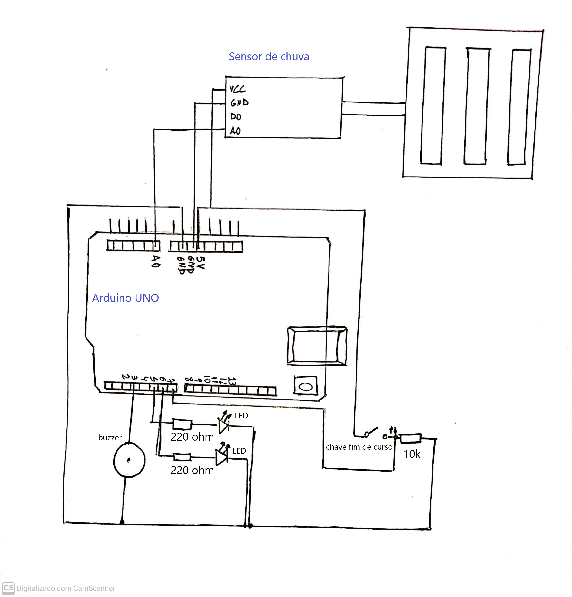
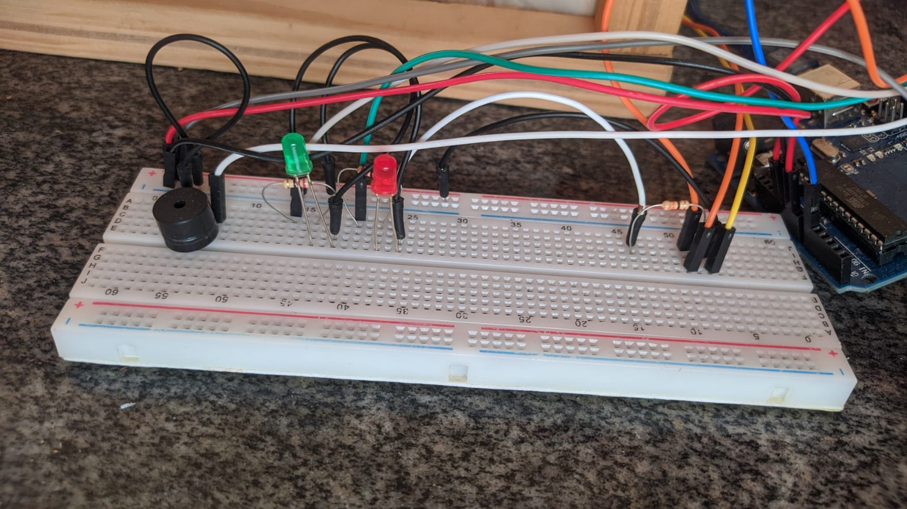

# Alerta com sensor de chuva

Projeto da disciplina Projeto Integrado à Computação. O projeto feito nesse repositório é um alerta que avisa caso esteja chovendo para que possamos fechar uma janela por exemplo.

 | Sumário |
 |---------|
 | [Ideia do projeto](#ideia-do-projeto)|
 | [Cronograma](#cronograma)|
 | [Fases do projeto](#fases-do-projeto)|
 | [Lista de componentes](#lista-de-componentes)|
 | [Esquemático do projeto](#desenho-do-projeto)|
 | [Projeto montado](#projeto-montado)|
 | [Video do projeto](#video-do-projeto)|
 | [O nosso processo](#o-nosso-processo)|

## Ideia do projeto

Nosso projeto é um alerta com sensor de chuva. Assim que o sensor detectar a presença de agua, o LED vermelho acende e se a janela tiver aberta o buzzer irá apitar com um delay de 2 segundos, só irá parar de apitar quando a janela fechar. Se não houver agua no sensor, o LED verde ficará aceso o tempo todo sem nenhum barulho do buzzer.

## Cronograma

- [x] - Todos os materiais em mãos que não sejam emprestados. (07/01)
- [x] - Primeira versão do código. (15/01)
- [x] - Início da montagem física do projeto. (30/01)
- [x] - Início do teste do projeto. (15/02)
- [x] - Melhorias físicas e no código. (28/02)

## Fases do projeto

- [x] Escolha de um projeto
- [x] Estudar Arduino
- [x] Pesquisa de materiais
- [x] Verificar preço de material
- [x] Compra de materiais
- [x] Inicio da montagem da janela
- [x] Verificar materiais que faltam com o professor
- [x] Desenvolvimento do código
- [x] Prototipação no tinkercad
- [x] Montagem do circuito

## Lista de componentes

- 1 Arduino Uno
- 1 Protoboard
- 1 Leitora de CD desmontada
- 1 Buzzer
- 2 LED's
- 2 Resistores 220Ohms
- 1 Resistor 10k Ohms 
- 1 Chave fim de curso
- 1 Sensor de chuva
- 1 Arduino
- Jumpers macho-macho e macho-femea

## Desenho do projeto

  

## Projeto montado

  
  

## Video do projeto

Assista ao nosso vídeo mostrando o projeto hospedado no [youtube](https://www.youtube.com/watch?v=Yzhg9ooXy3A)

## O nosso processo

Para ver todo o nosso processo de montagem veja esse [(link)](DIO.md) 

